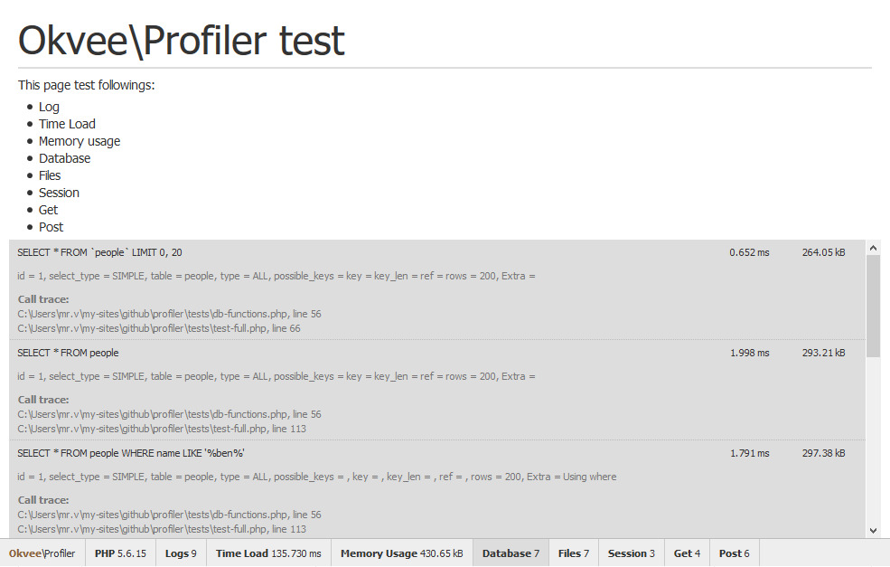

# Okvee\Profiler

Record processes logs and display to the web browser. This can help you check your application performance such as time and memory usage. 
To see how it works, please look inside tests folder.

This profiler use [Particletree PHP Quick Profiler][1] ideas.

[1]: http://www.particletree.com/features/php-quick-profiler/